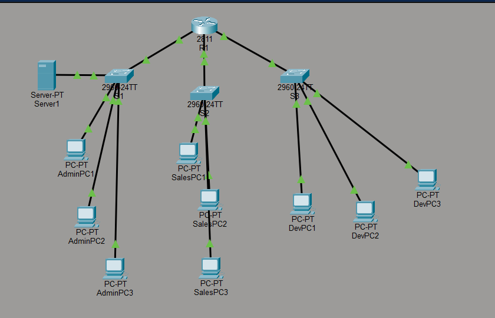
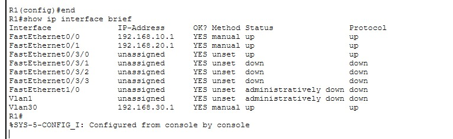
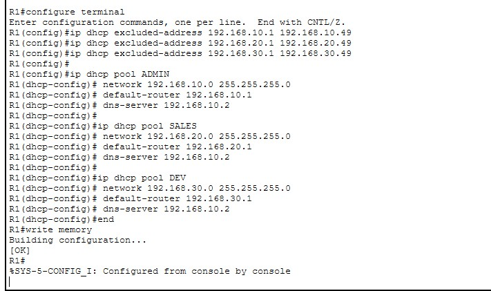
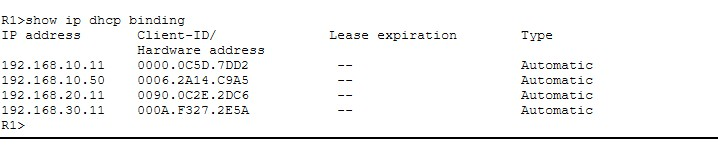
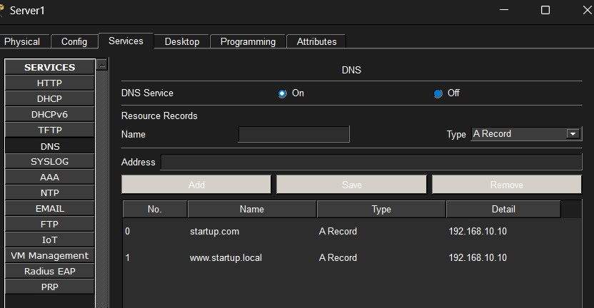
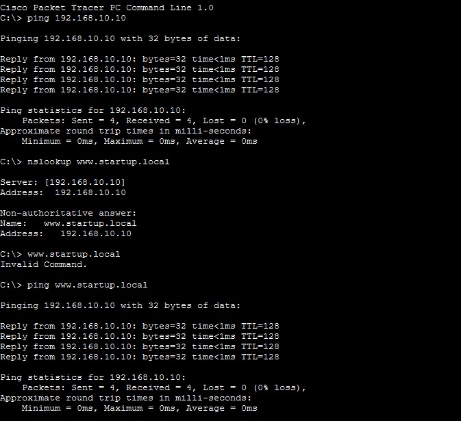
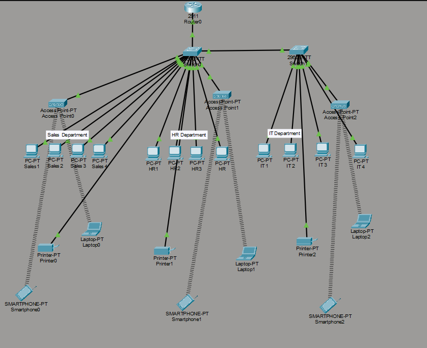

# Cisco Network Labs

Two networks built and verified in Cisco Packet Tracer, in order of complexity. Both
`.pkt` files are included, so you can open either topology and explore it live rather
than reading about it.

Lab 01 gets a working network running. Lab 02 takes the same basic shape and adds the
parts that make it defensible — segmentation at layer 2, access control between
departments, a limit on what can connect to a port, and a translated path to the outside.

Every screenshot in this repository is prefixed with its lab and section, so
`lab02-05-...` is Lab 02, port security.

---

# Lab 01 — Startup Network

📁 [`startup-network.pkt`](startup-network.pkt) · 📄 [`configs/lab01-r1.txt`](configs/lab01-r1.txt) · [`configs/lab01-s1.txt`](configs/lab01-s1.txt)

A network for a 25-person startup on a single site: three departments, each on its own
subnet, addressed automatically by the router and resolving an internal hostname through
a local DNS server.

At this size a single LAN is the right answer — one location, one broadcast domain per
department, no need for the cost or complexity of anything wider. Wireless can be added
later by hanging access points off the existing switches rather than redesigning.



R1 routes between three switched segments — Admin (S1), Sales (S2) and Dev (S3) — with a
server on the Admin segment.

## Addressing

| Department | Network | Gateway | Router interface | Switch |
|---|---|---|---|---|
| Admin | 192.168.10.0/24 | 192.168.10.1 | Fa0/0 | S1 |
| Sales | 192.168.20.0/24 | 192.168.20.1 | Fa0/1 | S2 |
| Dev | 192.168.30.0/24 | 192.168.30.1 | Vlan30 (SVI) | S3 |

Addresses `.1` to `.49` are excluded from every pool and reserved for gateways, switches
and the server, so the router cannot lease an address that infrastructure is already
using. Clients start at `.50`.

Dev is routed through a switched virtual interface rather than a physical port, since the
router had no free FastEthernet interface left for a third segment.



## DHCP

Three pools on the router, one per department.

```
ip dhcp excluded-address 192.168.10.1 192.168.10.49
!
ip dhcp pool ADMIN
 network 192.168.10.0 255.255.255.0
 default-router 192.168.10.1
 dns-server 192.168.10.2
```



Verified two ways. Each PC shows an address in its own subnet with the right gateway, and
the router's binding table confirms the leases were issued dynamically. The second check
is the one that matters — a statically configured PC looks identical from the client side.



Client evidence: [Admin](lab01-10-adminpc-dhcp-address.jpg) ·
[Sales](lab01-11-salespc-dhcp-address.jpg) · [Dev](lab01-12-devpc-dhcp-address.jpg)

## Switch management addressing

[`lab01-04-s1-vlan1-management-address.jpg`](lab01-04-s1-vlan1-management-address.jpg)

VLAN 1 given an IP and a default gateway on S1, so the switch can be reached and
administered rather than only passing traffic.

**Duplicate address found here.** The management address chosen, `192.168.10.10`, was
already in use by the DNS server on the same segment, and the switch logged it:

```
%IP-4-DUPADDR: Duplicate address 192.168.10.10 on Vlan1, sourced by 0006.2A14.C9A5
```

This is worth keeping in the write-up rather than hiding, because it is exactly the class
of fault that a management VLAN invites: infrastructure addressing and server addressing
drawn from the same range with nothing tracking what is taken. The fix is to move the
switch onto a reserved management address distinct from the server, and in a larger design
to put management on its own VLAN entirely.

## DNS



An A record for `www.startup.local` on the internal server, so staff reach internal
services by name instead of memorising an address.



Tested with `nslookup` to confirm the name resolves, then with `ping` to confirm the
resolved host actually answers. Resolution and reachability are separate failures and
worth testing separately.

## Connectivity between departments

[Admin](lab01-05-ping-admin.jpg) · [Sales](lab01-06-ping-sales.jpg) ·
[Dev](lab01-07-ping-dev.jpg)

Pings across all three subnets succeed. The first packet in the cross-subnet tests times
out and the remaining three reply — that is ARP resolution on the first attempt, not a
routing fault, and it is normal on an idle network.

# Lab 02 — Segmented Enterprise Network

📁 [`enterprise-network.pkt`](enterprise-network.pkt)

A three-department enterprise network: subnetted and segmented into VLANs, routed between
them on a single router interface, addressed by DHCP, secured at the access port and at
the VLAN boundary, extended with wireless, and given internet access through NAT.

## Design

| Department | Network | VLAN |
|---|---|---|
| Sales | 192.168.10.0/26 | 10 |
| HR | 192.168.10.64/26 | 20 |
| IT | 192.168.10.128/26 | 30 |

One `/24` subnetted into three `/26`s — 62 usable hosts each, more than enough per
department, while keeping them in separate broadcast domains and separate address ranges.
That separation is what makes the later access control work: you can write a rule about
"the Sales network" because Sales occupies a range of its own.



## VLANs and trunking

[`lab02-02-01-vlan-brief-switch0.png`](lab02-02-01-vlan-brief-switch0.png) ·
[`lab02-02-02-vlan-brief-switch1.png`](lab02-02-02-vlan-brief-switch1.png) ·
[`lab02-02-03-ports-assigned-switch0.png`](lab02-02-03-ports-assigned-switch0.png) ·
[`lab02-02-04-ports-assigned-switch1.png`](lab02-02-04-ports-assigned-switch1.png) ·
[`lab02-02-05-trunk-interfaces.png`](lab02-02-05-trunk-interfaces.png)

VLANs 10, 20 and 30 on both switches, access ports assigned per department, and a trunk
on the inter-switch link so all three VLANs cross it on one physical connection. Verified
with `show vlan brief` and `show interfaces trunk`.

## Inter-VLAN routing

[`lab02-03-01-physical-interfaces-shutdown.png`](lab02-03-01-physical-interfaces-shutdown.png) ·
[`lab02-03-02-router-subinterfaces.png`](lab02-03-02-router-subinterfaces.png) ·
[`lab02-03-03-sales-gateway.png`](lab02-03-03-sales-gateway.png) ·
[`lab02-03-04-hr-gateway.png`](lab02-03-04-hr-gateway.png) ·
[`lab02-03-05-it-gateway.png`](lab02-03-05-it-gateway.png)

Routing done on subinterfaces of a single router port — `g0/0.10`, `g0/0.20`, `g0/0.30` —
each with an 802.1Q tag and the department's gateway address.

The two spare physical interfaces were deliberately shut down rather than left
unconfigured, so the running configuration reflects the intended design rather than
leaving unused ports in an ambiguous state.

## DHCP

[`lab02-04-02-sales-pool-cli.png`](lab02-04-02-sales-pool-cli.png) ·
[`lab02-04-03-hr-pool-cli.png`](lab02-04-03-hr-pool-cli.png) ·
[`lab02-04-04-it-pool-cli.png`](lab02-04-04-it-pool-cli.png) ·
[`lab02-04-05-excluded-addresses.png`](lab02-04-05-excluded-addresses.png) ·
[`lab02-04-09-sales-pc-address-from-26-subnet.png`](lab02-04-09-sales-pc-address-from-26-subnet.png)

A pool per VLAN, configured through the router CLI — the router model in this topology has
no graphical DHCP tab ([`lab02-04-01`](lab02-04-01-no-gui-dhcp-tab-on-router-model.png)):

```
ip dhcp excluded-address <gateway range>
ip dhcp pool SALES
 network 192.168.10.0 255.255.255.192
 default-router 192.168.10.1
```

Gateway and infrastructure addresses were excluded before the pools were defined, so the
router cannot hand out an address it is already using.

## Port security

[`lab02-05-01-port-security-commands-switch0.png`](lab02-05-01-port-security-commands-switch0.png) ·
[`lab02-05-02-port-security-commands-switch1.png`](lab02-05-02-port-security-commands-switch1.png) ·
[`lab02-05-03-port-security-enabled.png`](lab02-05-03-port-security-enabled.png) ·
[`lab02-05-04-violation-shutdown-switch0.png`](lab02-05-04-violation-shutdown-switch0.png) ·
[`lab02-05-05-violation-shutdown-switch1.png`](lab02-05-05-violation-shutdown-switch1.png)

Each access port restricted to a single learned MAC address, violation action set to
shutdown. A second device takes the port down rather than being quietly allowed on.

This is the control that stops someone unplugging a desk phone and connecting their own
laptop to a department VLAN — the physical-access problem that VLANs alone don't solve.

## Access control lists

[`lab02-06-01-access-list-definition.png`](lab02-06-01-access-list-definition.png) ·
[`lab02-06-02-ip-access-group-applied.png`](lab02-06-02-ip-access-group-applied.png) ·
[`lab02-06-03-ping-blocked-sales-to-hr.png`](lab02-06-03-ping-blocked-sales-to-hr.png)

An extended ACL applied inbound on the Sales subinterface, blocking Sales from reaching
HR while leaving other traffic unaffected.

Tested with ICMP: pings from Sales to HR fail, confirming the rule is matching. Testing
the deny case is the point — an ACL that has never been shown to block anything has not
been verified.

## Wireless

[`lab02-07-01-sales-ap-config.png`](lab02-07-01-sales-ap-config.png) ·
[`lab02-07-02-hr-ap-config.png`](lab02-07-02-hr-ap-config.png) ·
[`lab02-07-03-it-ap-config.png`](lab02-07-03-it-ap-config.png) ·
[`lab02-07-07-topology-with-wireless-clients.png`](lab02-07-07-topology-with-wireless-clients.png) ·
[`lab02-07-08-wireless-client-dhcp-address.png`](lab02-07-08-wireless-client-dhcp-address.png)

An access point per department, each with its own SSID and WPA2-PSK. Laptops associate to
their department's AP and receive an address from that department's pool, so wireless
clients land in the same subnet and under the same ACLs as the wired hosts beside them.

WPA2-PSK over WEP or an open SSID: WEP's key scheme is broken and recoverable from
captured traffic, so an open or WEP network would undo the segmentation work at the radio
edge.

## NAT and internet access

[`lab02-08-01-topology-with-isp-router.png`](lab02-08-01-topology-with-isp-router.png) ·
[`lab02-08-03-nat-inside-outside.png`](lab02-08-03-nat-inside-outside.png) ·
[`lab02-08-04-nat-permitted-networks.png`](lab02-08-04-nat-permitted-networks.png) ·
[`lab02-08-05-default-route.png`](lab02-08-05-default-route.png) ·
[`lab02-08-06-nat-translation-table.png`](lab02-08-06-nat-translation-table.png)

NAT overload (PAT) translating all three internal networks to a single outside address,
with `ip nat inside` and `ip nat outside` on the relevant interfaces and an ACL defining
which networks may be translated.

A default route was added toward the ISP — without it the router has no path for traffic
outside its directly connected networks, and NAT has nothing to translate toward.

Verified with `show ip nat translations`.

---

## Opening these

Both `.pkt` files were built in Cisco Packet Tracer 8.x. A file saved in a newer version
will not open in an older one.

## Notes

Originally built for coursework on my BSc IT (Network and Security) at Eduvos,
reorganised here as standalone projects.
